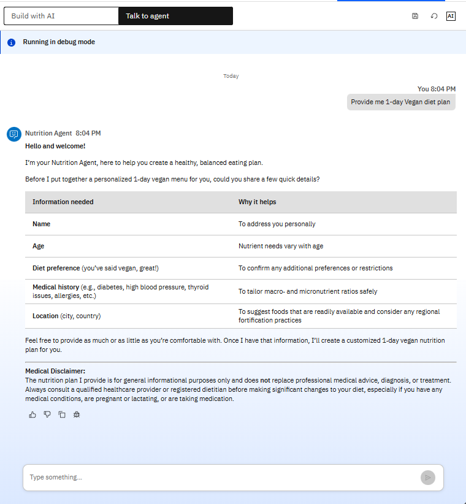
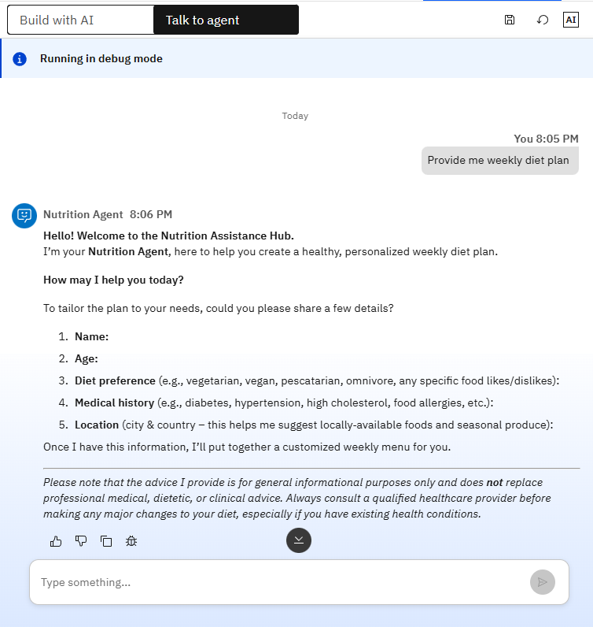
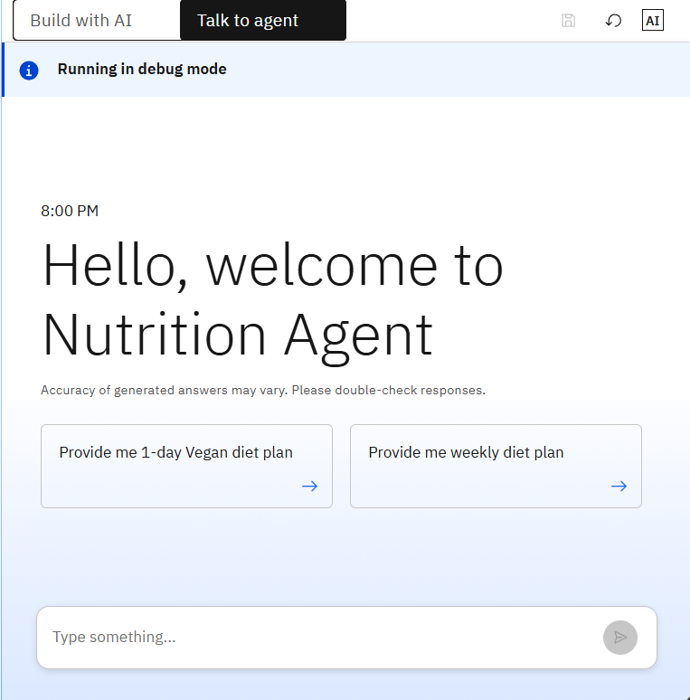
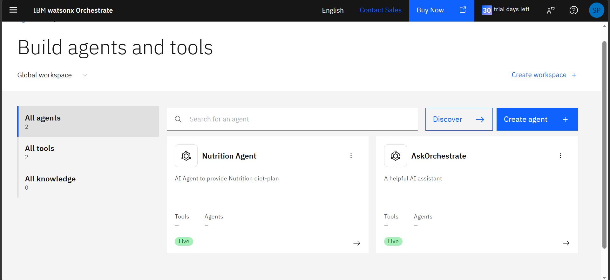

# Nutrition Agent

## Project Overview

Nutrition Agent is an AI-powered virtual nutrition assistant developed during the IBM SkillsBuild Internship Program in collaboration with Edunet Foundation using IBM watsonx Orchestrate.

The agent provides personalized nutrition guidance, meal recommendations, and diet plans through a conversational AI interface.

## Features

* Personalized diet recommendations
* Weekly meal planning
* Vegan diet planning
* Conversational AI assistance
* User-focused nutrition guidance

## Technologies Used

* IBM watsonx Orchestrate
* Artificial Intelligence
* Prompt Engineering
* Conversational AI

## Project Screenshots

### Weekly Diet Plan Generation

### Vegan Diet Plan Generation

### Welcome Screen

### Agent Overview

## Internship Details

* IBM SkillsBuild Internship
* Edunet Foundation
* IBM watsonx Orchestrate

## Learning Outcomes

* AI Agent Development
* Prompt Engineering
* Conversational AI Design
* User-Centered AI Applications

## Author

Shreya Prajapati

## Acknowledgements

This project was developed as part of the IBM SkillsBuild Internship Program in collaboration with Edunet Foundation.
